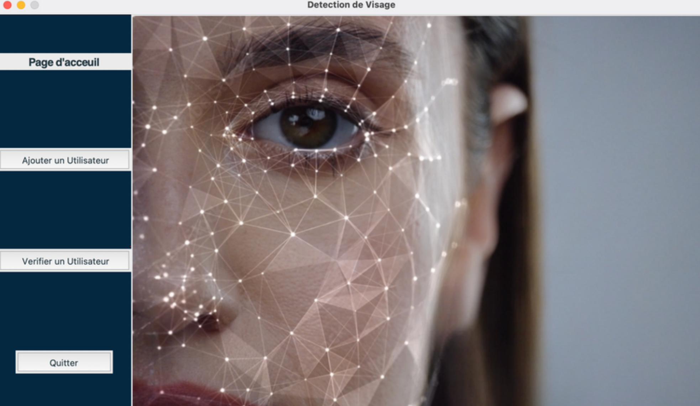

# Face-detection

## Description

Facial detection is an essential task in many fields, such as facial recognition, augmented reality, emotion analysis and surveillance. It consists in identifying and locating the faces present in an image or video. To accomplish this task, specific algorithms are used to detect the distinctive features of a human face. Training a face detection model generally requires a set of annotated data, i.e. images accompanied by the coordinates of the faces present. This data serves as a training base for the model, enabling it to learn to recognize faces in new images. Several algorithms and libraries are available for face detection. Among the most commonly used is OpenCV, a popular library for image and video processing.

## Interfaces

Home page

Add user

Capture data

User list

Recognition

## Docs

[Report (.pdf)](docs/rapport.pdf)